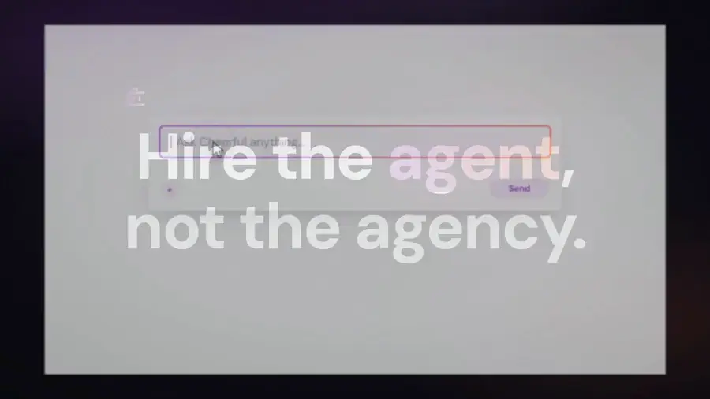

# Product Launch Motion Design — a Claude Code Skill

**Make product launch videos from code.** Install this skill, point Claude Code at your
product, and it directs and renders a launch film: script, voiceover, word-synced reveals,
real camera moves, film grade, broadcast-loudness master — as HTML, CSS and GSAP, rendered
frame by frame to MP4.

[](https://github.com/AbubakrChan/product-launch-motion/releases/download/v1.0.0/product-launch-motion-example-film.mp4)

Four beats from it, above. **[▶ Watch all 45 seconds](https://github.com/AbubakrChan/product-launch-motion/releases/download/v1.0.0/product-launch-motion-example-film.mp4)** — eleven
shots, no After Effects, no stock footage, no GPU renderer, no diffusion model. The render
is deterministic, so the same commit produces the same file.

```bash
npx skills add AbubakrChan/product-launch-motion
```

---

## Why this exists

Programmatic video tools solve rendering. They do not solve **direction** — and direction
is the entire difference between a launch film and a slideshow.

A composition can lint clean, render without error, hit every deadline, and still look
like a template. The gap is craft: does the reveal land on the word? Is the camera
actually moving, or is everything just drifting? Can you see the cursor? Is the
"typing sound" you added *actually audible*, or is it 20 dB under the narration and
mathematically inaudible?

This skill is that craft, written down — ten laws, a fourteen-step pipeline, fourteen
shots, and thirty-four traps, each recorded with **the measurement that proves it** rather
than the vibe that suggested it.

It also won't hand you a house style. Before building anything it writes three different
visual directions and kills two, so two products never get the same film.

## What you get

- **12 reference documents** — direction, story, sync, motion, camera, look, sound, QA,
  a catalog of 14 shots, 34 traps, and how to ship the final set.
- **8 scripts** that do the fiddly parts: assemble, transitions, audio, grade, levelling,
  word timings, mastering, and proving a sound is audible.
- **5 templates**, including a frame that already has the camera rig and cursor in it.
- **A worked example** — a real film, revision by revision, with the note that prompted
  each change.
- **A baseline evaluation** — the skill run against itself, with and without. It found
  three bugs in its own scripts and one missing chapter; all fixed.
  [`evals/BASELINE.md`](evals/BASELINE.md)

## Install

```bash
npx skills add AbubakrChan/product-launch-motion
```

Then ask for what you want:

> Make a 45-second launch video for my product at example.com

That's it. The skill takes it from there — it will ask you the things it needs.

**You'll need** [Node](https://nodejs.org) and [FFmpeg](https://ffmpeg.org)
(`brew install ffmpeg`). Everything else it tells you about when it needs it, and nothing
costs money: the voiceover can be a free local model, your own voice, or any TTS you
already pay for.

<details>
<summary>The full requirements list, if you like knowing up front</summary>

| Need | Notes |
|---|---|
| Node ≥ 20 | runs the scripts |
| FFmpeg | measures the voiceover, masters the film, proves a sound is audible |
| A renderer | [HyperFrames](https://hyperframes.heygen.com) by default; works with Remotion too |
| GSAP | every frame's timeline. Vendor it rather than loading from a CDN, so a render never depends on the network: `curl -sL https://cdn.jsdelivr.net/npm/gsap@3.14.2/dist/gsap.min.js -o vendor/gsap.min.js`. Free for this use under GSAP's [standard licence](https://gsap.com/licensing/) |
| Python 3.10+ | *optional* — only for free offline text-to-speech |
| A transcriber | *optional* — Whisper, or anything that returns word-level timestamps |

</details>

<details>
<summary>What it actually does, step by step</summary>

You don't have to run any of this yourself — it's what the skill does when you ask. It's
here so you can see the shape of it, and so you can drive it by hand if you'd rather.

```bash
# 1 · the brief — product, audience, the one claim
cp assets/BRIEF.md ./BRIEF.md

# 2 · direction — three different looks, two of them killed
#     this is the step that decides whether the film is any good

# 3 · voiceover first. Frame lengths come from the real recording, never a guess

# 4 · word timings, so every reveal can be cued to the word that describes it
node scripts/word-timings.mjs --transcript 01.json --id 01-hook --out audio_meta.json

# 5 · one HTML file per shot, starting from a skeleton that already has
#     the camera rig and the cursor
cp assets/frame-skeleton.html compositions/frames/01-hook.html

# 6 · assemble the film — this order, every time
cp assets/film.example.json ./film.json
node scripts/assemble.mjs && node scripts/transitions.mjs \
  && node scripts/wire-audio.mjs && node scripts/wire-grade.mjs

# 7 · check, render, master, and prove it worked
npx hyperframes check --no-contrast
npx hyperframes render -o renders/video-v1-raw.mp4
./scripts/master.sh renders/video-v1-raw.mp4 renders/video-v1.mp4
./scripts/verify-cue.sh renders/video-v1.mp4 10.72 0.76
```

</details>

## The craft it encodes

Timing and easing — custom-bezier ease-out, spring and settle, staggered entrances,
anticipation, speed ramping, deliberate holds, beat-synced cuts.
**Camera** — dolly, parallax, orbit and turntable, rack focus, whip pan, zoom-to-detail.
**Type** — kinetic typography, mask reveal from the baseline, blur-in, tracking-in,
odometer counters, text morphs.
**Look** — film grain, bloom and halation, chromatic aberration, light sweeps, aurora and
gradient-mesh grounds, glassmorphism, vignette, lifted blacks, a tight palette with one
accent.
**3D and product** — exploded views, floating isometric mockups, HDRI-style lighting.
**SaaS and UI** — fake cursor with ripples, UI card staggers, skeleton-to-results loading,
progressive disclosure, state flips.
**Sound** — whooshes, UI ticks, sub-bass on hero hits, and silence before the reveal.
**Structure** — cold opens, problem-agitate-solve arcs, register flips as story turns.

Each one is documented as *when to use it and what breaks*, not just as a name.

## Stack

**GSAP for the motion, HyperFrames to render it, FFmpeg to master it.** Remotion works
too, and the skill includes the translation.

<details>
<summary>Five tools were raced before settling on that — here's what lost, and why</summary>

One beat each, built and rendered for real rather than compared on paper.

| Tool | Verdict | Why |
|---|---|---|
| **GSAP** | **Core of the system** | Best craft-per-cost, seek-deterministic, zero new dependency. Every frame's timeline is one paused GSAP timeline. |
| **HyperFrames** | **The renderer** | HTML-as-video with a seekable timeline, word-level audio mounting and a real lint/layout/contrast gate. |
| **Lottie** (`lottie-web`) | **Use for logo draw-ons** | Great for vector draw-on. Trap: an animated multi-dimensional *layer* transform silently blanks the layer in render while playing fine in preview. Keep layer transforms static; drive motion from GSAP on the container. |
| **Remotion** | **Per-shot co-host** | Genuinely better React ergonomics, real `spring()` physics, and a WebGL post pass over live DOM. We kept the long-form film elsewhere for its word-sync workflow, but Remotion is a first-class choice — the skill's laws all port. |
| **Three.js** | **One hero shot only** | The only real-camera, real-light route without a GPU renderer. Trap: bloom over a near-white UI screenshot blows out to a white cloud — tone-map first. |
| **Rive** | **Runtime yes, authoring no** | The runtime is seek-deterministic (verified: 150 frames rendered twice, identical hashes). But `.riv` is a compiled binary and the editor is GUI-only, so an agent can't author one. |
| After Effects, C4D, Octane, Blender | **Ruled out** | GUI-only or not installable. An agent cannot drive them. This is why the whole system is code. |

</details>

## A taste of the trap index

These are the ones that cost hours. All 34 are in `references/10-traps.md`.

- **Turning a sound effect up cannot save a quiet one.** Going from `0.35` to `0.85`
  moved the actual film by **0.1 dB**. Fix the file, not the volume.
- **A film can render completely white** from one line of CSS (`mix-blend-mode`), and
  nothing about the source will tell you why.
- **Film grain makes the file 7× bigger** — 9.3 MB became 67.3 MB — unless you hold the
  grain across frames the way real film does.
- **Your sound effect can be in the film, at the right volume, and still start too late
  to hear** if the audio file opens with a moment of silence. That one shipped.

Each of the 34 is written up with the command that proves it, in
`references/10-traps.md`.

## FAQ

**Will every video made with this look the same?**
No. The pipeline forces three competing directions before any building, and a checklist
names the skill's own defaults so an agent can catch itself reaching for them. What
repeats is the discipline — sync, determinism, sound arithmetic, mastering — not the
aesthetic. `references/11-creative-direction.md`.

**Does this work for physical products, not just software?**
Yes. The shot catalog covers hardware heroes, unboxing and exploded views, e-commerce
line items and floating product mockups alongside the SaaS shots. The laws are
product-agnostic; only the shot selection changes.

**Do I have to use HyperFrames?**
No. The laws — word-locked sync, the two-node camera, the cursor spec, sound arithmetic,
mastering — are renderer-neutral, and `references/01-renderer-contract.md` includes the
Remotion equivalents. HyperFrames is the default because it ships the gates.

**Can I use my own voice, or a cloned one?**
Yes. The pipeline needs a WAV plus word-level timestamps. Anything that produces those
works — human recording, ElevenLabs, local Kokoro. Swapping voices means re-deriving the
timings, because every cue is locked to the words.

**Is this an AI video generator?**
No, and that is the point. Nothing is diffused or hallucinated. Every frame is code you
can read, diff and fix, so the output is deterministic, brand-exact, and never invents a
number or a face.

**How long does a film take?**
Measured on an M-series laptop: the 44-second reference film **renders in 51s**
(`rendered in 51.1s`, 40 MB raw) and **masters in 30s** (`real 30.35` — two ffmpeg
passes plus a full re-encode, and the re-encode is most of it). The direction loop — the part that matters — takes as many passes as you have
notes.

## Troubleshooting

<details>
<summary>Common setup errors and what they mean</summary>

| What you see | What it means |
|---|---|
| `no film.json — copy assets/film.example.json and edit it` | The manifest is the input to the whole chain. Copy the example; it is the reference film's real one. |
| `no index.html — run assemble.mjs first` | Wiring scripts mount into an assembled index; they never create one. |
| `no cue table at audio/cues.json` | `cp assets/cues.example.json audio/cues.json`, then edit. |
| `no frame wrappers in index.html — assemble first` | Your index has no `data-composition-src` elements, so there is nothing to time against. |
| `<file> has no transitions markers` | The index wasn't written by `assemble.mjs`. Re-assemble, or paste `/* transitions:start */ … /* transitions:end */` into your root timeline's IIFE. |
| `ffprobe not found — install ffmpeg` | `brew install ffmpeg` (Linux: `apt install ffmpeg`). Needed to measure voiceover, not just to master. |
| `gsap is not defined` in the render | You copied the frame skeleton without vendoring GSAP — see Requirements. |
| A tween plays in preview and is missing in the render | Something in it is non-deterministic — `Math.random`, `Date.now`, a CSS `transition`, `repeat`/`yoyo`. The renderer seeks; it does not play. See the determinism rules in `references/01-renderer-contract.md`. |
| The whole film renders white | A `mix-blend-mode` over a per-track composite: a `multiply` vignette with no backdrop paints its own source colour. Trap 1, and it is not visible in the source. |
| An edit to `index.html` keeps disappearing | The index is generated. Put it in a wiring script's marked block instead. Trap 3. |
| Everything works and the film is boring | That is the actual hard problem, and it is what `references/11-creative-direction.md` and `08-qa-and-direction.md` are for. |

Every script takes `--help` and prints its own documentation.

</details>

## Contributing

Traps are the most valuable contribution. If you find one, open a PR against
`references/10-traps.md` with the measurement that proves it — the number, the command,
and the before/after. That standard is the whole reason this file is useful.

## License

MIT — see [`LICENSE`](LICENSE). The craft is meant to travel.

**The film does not.** The reference film and the frame reproduced under `examples/`
belong to the client it was made for. See [`NOTICE`](NOTICE) — it also covers GSAP, which
these docs tell you to vendor into your own project.
